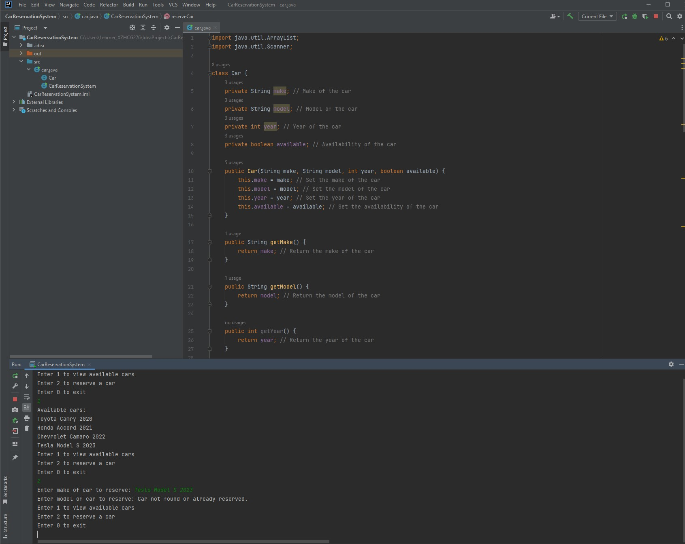

# Car Reservation System
This is a Java program that allows users to view and reserve cars from an inventory.

### How to Use
To run the program, compile the CarReservationSystem.java file using a Java compiler. Then run the program using the java command:
```
java CarReservationSystem
``` 
This will launch the program and display a menu with three options:

- Enter 1 to view available cars
- Enter 2 to reserve a car
- Enter 0 to exit the program

To view available cars, select option 1. This will display a list of cars that are currently available for reservation.

To reserve a car, select option 2. You will be prompted to enter the make and model of the car you want to reserve. If the car is available, the program will reserve it and notify you. If the car is not available or not found in the inventory, the program will notify you as well.

To exit the program, select option 0. This will terminate the program.

### Challenge Implementation Description
The challenge was to implement a car reservation system that allows users to view and reserve cars from an inventory. The program should be able to handle multiple users at the same time. The program should also be able to handle multiple reservations for the same car.

The `Car` class represents a car in the inventory. It has four private fields: `make`, `model`, `year`, and `available`. It has a constructor that initializes these fields, and getter and setter methods to access and modify them. It also has a `toString` method that returns a string representation of the car.

The `CarReservationSystem` class is the main class of the program. It has a private static `inventory` field that is an `ArrayList` of `Car` objects. It also has two private static methods: `viewAvailableCars` and `reserveCar`. The `viewAvailableCars` method loops through the inventory and prints the available cars. The `reserveCar` method prompts the user for the make and model of the car to reserve, loops through the inventory to find the car, and reserves it if available.

The `main` method of the `CarReservationSystem` class initializes the inventory with some sample cars, and displays a menu to the user. It uses a `Scanner` object to read user input, and a `switch` statement to execute the selected option.

